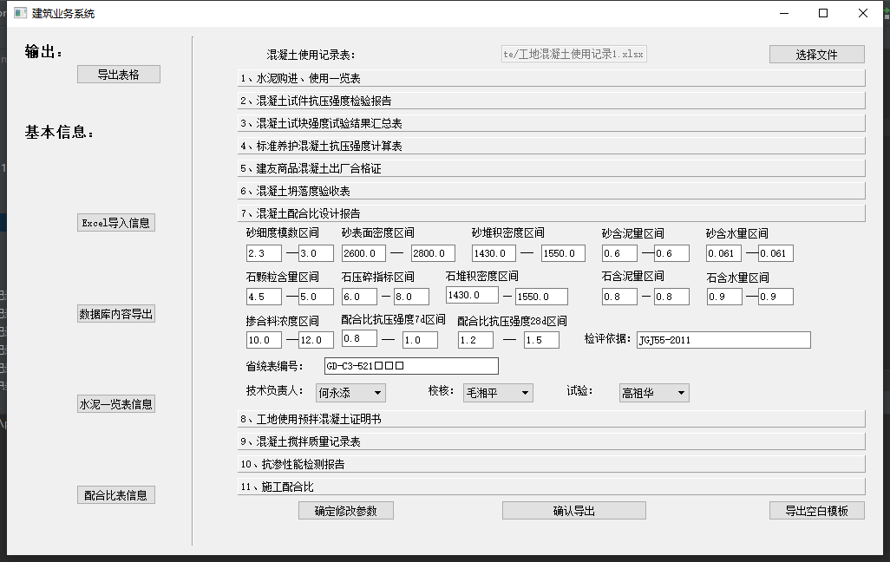
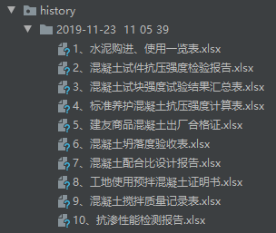
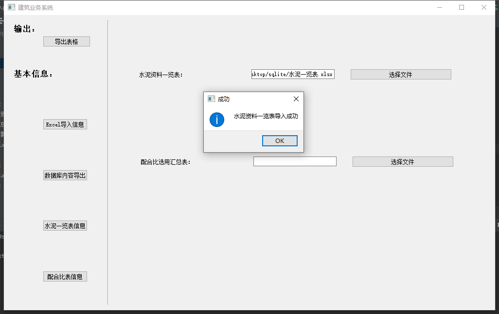
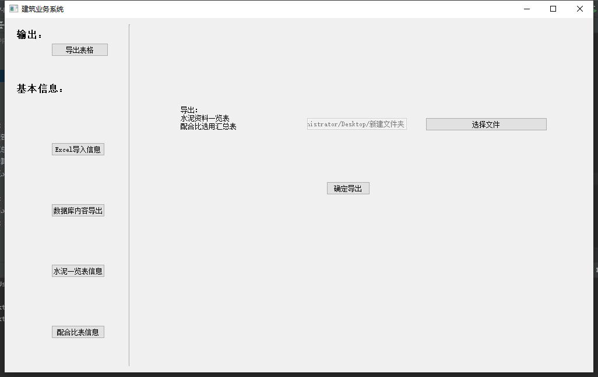
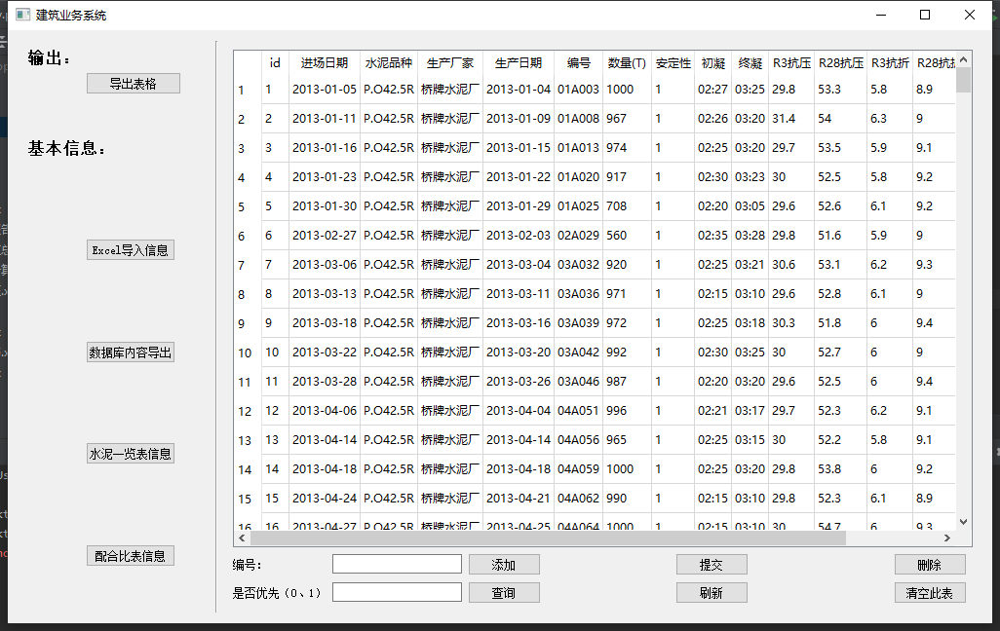
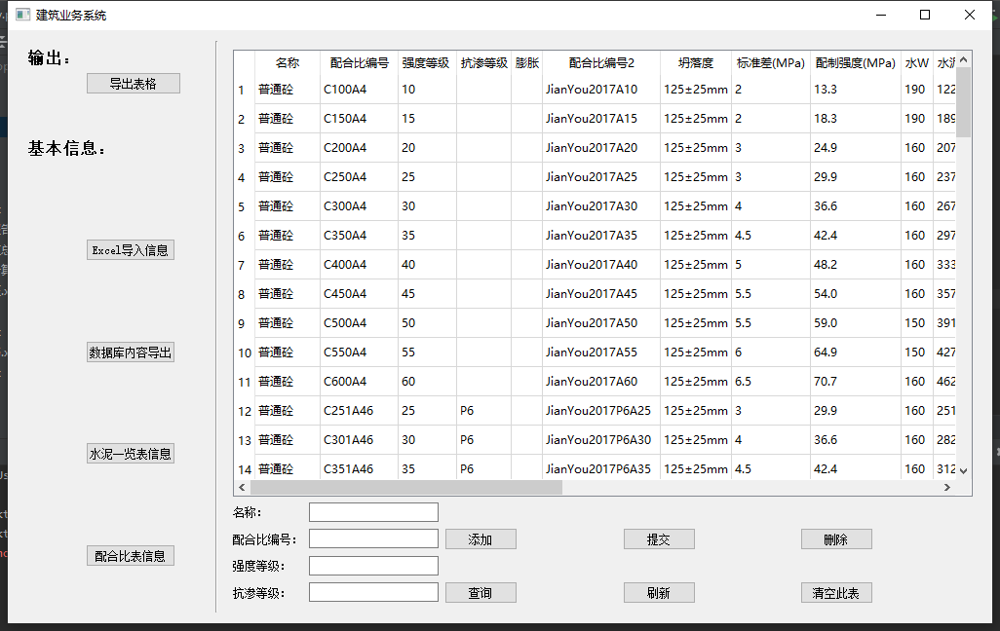

# 水泥业务系统

关键技术:openpyxl、sqlite、Mysql(为了简化，后面改用了sqlite)、pyqt5、sqlalchemy、pandas、numpy等技术。考虑过xlrd与xlwt，但是用起来没有openpyxl方便，所以这两个库只是用来简单的转变excel格式。

## 导出表格

实现了参数的修改，和生成空白模板和客户所需的模板。并有历史记录。

## Excel导入

主要讲excel数据导入到sqlite数据库中

## 数据库内容导出

## 水泥一览表信息

## 配合比表信息

